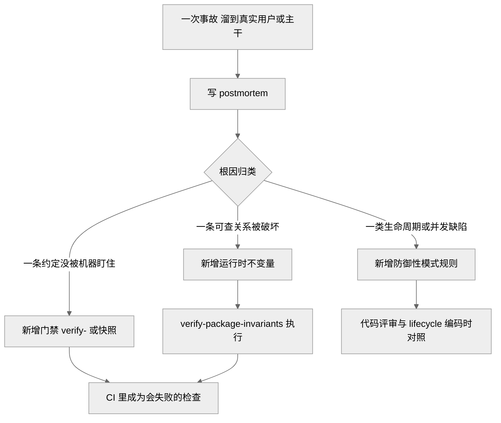
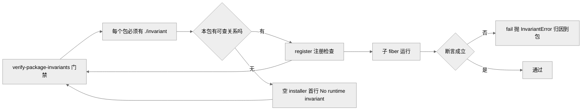

# 第 35 章 · 事故复盘与不变量

> 前面几章讲「事前怎么把事情做对」——门禁（第 30 章）拦住机器可查的错，决策志（第 34 章）记下「为什么这么设计」。本章补上另一半：**事情已经做错了、还溜到了真实用户或已合并的主干面前，之后怎么办。** 答案不是「下次小心点」，而是一套把「一次事故」机械地转化成「一条会失败的检查」的制度。

## 一、复盘制度：postmortem 是什么，何时该写

先厘清一个容易混淆的区分。仓库里有两类回溯性文档，方向正好相反。**Agent Note（决策笔记，见第 34 章）是向前看的**——记录一个刻意做出的设计决定和被否掉的备选，或提出未来工作；**postmortem（事故复盘）是向后看的**——记录一次失败：什么坏了、坏的机制是什么、为什么每一道安全网都没接住它、以及为防止同类问题再次悄悄溜过而新增的具体护栏 `[verified]`（`docs/postmortem/README.md:7`）。

不是每个 bug 都值得写复盘。判据是三个「与」：**subtle（隐蔽）**——机制不显而易见，一个细心的工程师也得费劲重新推导一遍；**systemic（系统性）**——它能溜过去的原因是测试/工具/约定里的一处缺口，而非一次性笔误；**costly to rediscover（重新发现代价高）**——它已经花掉了真实的排查时间，且下次还会再花一遍 `[verified]`（`docs/postmortem/README.md:9`）。三者叠加，才动笔。每篇复盘都以一段三十秒能读完的 **Executive summary（执行摘要）** 开头，再展开 Summary / Timeline / Root cause / Guardrails `[verified]`（`docs/postmortem/README.md:11`）。这个体例本身就在提醒作者：复盘的重点是「过程为什么放它过去」，不是那行一句话就能改完的修复。

## 二、四篇复盘逐一深读

四篇复盘共享同一副骨架——**破坏机制 → 安全网为何失守 → 新增护栏**。逐篇拆开看，会发现它们的「安全网失守」惊人地相似：测试全绿、覆盖率满格，却没有一条测试走过产品真正发货时的那条路径。

**0001 —— `export default` 让 Loader 丢弃 `inject`。** ACP（Agent Client Protocol，自动化用的代理客户端协议）服务器一被真实编辑器（Zed）连上就崩，`session/new` 直接报「拿不到 `agents`、因为没有 inject」`[verified]`（`docs/postmortem/0001-acp-default-export-drops-inject.md:13`）。破坏机制是一行多余的 `export default apply`：ACP 插件本是「命名空间插件」，把 `name`/`inject`/`Config`/`apply` 作为并列的命名导出；但当 Loader（加载器）从 `cordis.yml` 加载模块时，会经 `unwrapExports` 用 `exports.default ?? exports` 归一化——有了默认导出，它就解析成那个光秃秃的 `apply` 函数，`inject` 等兄弟导出被整个丢掉，插件于是在一个「没有任何注入服务」的 fiber 里运行，第一行读 `ctx.agents` 就抛错 `[verified]`（`docs/postmortem/0001-acp-default-export-drops-inject.md:36,50,52`）。安全网为何失守？178 个单元测试全绿、行覆盖率 100%，但它们全部用「手搓插件对象」（`ctx.plugin({name, inject, apply})`）挂载——手动补上了 `inject`，而 `unwrapExports` 只有真正的 Loader 才会调用，测试永远碰不到 `[verified]`（`docs/postmortem/0001-acp-default-export-drops-inject.md:93,98`）。护栏：删掉 `export default apply`；新增一条**无 key、走真实 stdio 的 `session/new` e2e**——把例子作为子进程经真实 Loader 启动，恢复那行 bug 就会红 `[verified]`（`docs/postmortem/0001-acp-default-export-drops-inject.md:102,104`）。

**0002 —— `!!js` 表达式位置错致文件系统工具被永久禁用。** ACP 默认组合刻意只给 bash，快照场景却需要 `read`/`write`/`edit`，于是有人给文件系统插件写了 `disabled: !!js ...` 想按模式条件启用 `[verified]`（`docs/postmortem/0002-js-expression-disabled-filesystem-tools.md:13`）。破坏机制：Cordis 只在插件 `config` 字段里求值 `!!js` 表达式——`Entry._resolveConfig()` 会插值 `config`，而 `Entry.disabled` 直接读原始的 `entry.options.disabled` 不插值。那个表达式对象是「真值」，于是文件系统栈在每种模式下都恒被禁用；YAML 标签语法上又合法，加载时毫无诊断 `[verified]`（`docs/postmortem/0002-js-expression-disabled-filesystem-tools.md:15,32`）。安全网为何失守？快照框架把「任何确定性 transcript」都当成合法行为——刷新时它把带 `UNKNOWN_TOOL`（工具未找到）的错误输出直接写成了新的期望值，等于把回归本身「录」成了标准答案 `[verified]`（`docs/postmortem/0002-js-expression-disabled-filesystem-tools.md:19,34`）。护栏：改用显式的 `fs.cordis.yml` 全权限 overlay；在 `AGENTS.md` 与 Cordis primer 里写明「`!!js` 只在插件 `config` 下有效」；`verify-cordis-config` 拒绝 Loader 条目元数据里的表达式节点；`dsh-acp-snapshot` 拒绝把 `UNKNOWN_TOOL` 结果录成期望输出 `[verified]`（`docs/postmortem/0002-js-expression-disabled-filesystem-tools.md:38,39,40,41`）。

**0003 —— Web agent 校验了替身服务器而非当前 GUI。** 一个 Web agent 改了 GUI 源码，却不知道自己这次会话是被哪个 URL、哪个进程托管的 `[verified]`（`docs/postmortem/0003-web-agent-gui-feedback-loop.md:9`）。破坏机制：Web 装配没有给「当前 GUI、规范 URL、运行模式」任何模型可见的身份，于是 agent 一路做出「单独看都合理、却不共享同一个验收目标」的动作——把源码编辑、构建成功、HTTP 200、注入的启动清单、用户正在用的页面当成了可互换的事实 `[verified]`（`docs/postmortem/0003-web-agent-gui-feedback-loop.md:16,34`）。它先把验收甩回给用户，又把「裸 Vite 返回 200、其实是缺 `window.__DSH_BOOT__` 的白屏」当成功，最后在另一个端口拉起一个替身 `dsh web` 服务器去校验，而用户原来那个页面早已自己加载了重建的产物 `[verified]`（`docs/postmortem/0003-web-agent-gui-feedback-loop.md:36`）。护栏：Web 启动器把规范 loopback URL 和真实的生产/开发模式发布进日志的 `app:web-surface` 提示段与受管的 `$DSH_WEB_URL`/`$DSH_WEB_MODE` 环境；裸 Vite 独立服务模式在配置期直接拒绝，并对 `Server.listen()` 打桩，让一次瞬时绑定不能蒙混过关 `[verified]`（`docs/postmortem/0003-web-agent-gui-feedback-loop.md:42,44`）。

**0004 —— Landlock 部分执行提示致子进程失败被误判**（与第 13 章沙箱交叉引用）。在较老 Landlock ABI 的内核上，原生启动器会先打印一行温和的「部分强制」提示，再照常执行子进程 `[verified]`（`docs/postmortem/0004-landlock-partial-notice-misclassified-child-failures.md:14`）。破坏机制：harness 把「提示行」和「致命失败行」都压成了同一个大小写不敏感的 `landlock-run: ` 子串，消费方于是把「带此子串 + 任意非零退出」一律判成启动器失败——ripgrep「无匹配」的退出码 1、无效模式的退出码 2、甚至子进程自选的 125，都会在成功受限执行的前提下被赖到沙箱头上，报成 `SANDBOX_UNAVAILABLE`；当时基于 bash 的文件搜索又把这个结构化错误藏进泛化的 `SEARCH_FAILED` `[verified]`（`docs/postmortem/0004-landlock-partial-notice-misclassified-child-failures.md:15,17`）。安全网为何失守？测试矩阵照搬了那个「一袋子串」的贫弱表示——假 provider 要么不发提示行、要么发无歧义的致命前缀，从没发过「温和提示行 + 之后子进程非零退出」这一组合；真实 Landlock 覆盖又依赖宿主 ABI，全 ABI 的机器根本触发不了这个提示 `[verified]`（`docs/postmortem/0004-landlock-partial-notice-misclassified-child-failures.md:37`）。护栏：`RunnerFailureRule` 现在带「允许的退出码 + 逐行致命签名 + 精确的信息行排除」，Landlock 映射为「退出 125 + 一条非提示的 `landlock-run:` 行」；`dsh-tool-fs-search` 改用打包的 ripgrep 走 `ctx.subprocess`、彻底离开受沙箱的 bash 缝；并新增装配级的 `partial-landlock` 快照组合把这条产品路径钉住 `[verified]`（`docs/postmortem/0004-landlock-partial-notice-misclassified-child-failures.md:43,46,48`）。

> 图注：此图是本章主线——`dsh` 把「一次事故」机械地转化成三类可复用的护栏，最终都收敛到「CI 里一条会失败的检查」上，与第 30 章门禁一脉相承 `[verified]`（`docs/postmortem/README.md:9`）。

## 三、不变量子系统：把教训固化成「会失败的检查」

复盘写完，最有力的护栏往往不是文档，而是一条运行时**不变量（invariant）**——一个断言「这个包所拥有的某种关系必须始终成立」的检查。`dsh-invariants` 是承载它的可配置注册服务 `ctx.invariants` `[verified]`（`docs/subsystems/invariants.md:5`）。机制分三层：其一，**注册**——`ctx.invariants.register(packageName, installer)` 为完整 npm 包名保留唯一登记项，返回一个 effect 作用域的 disposer；即便过滤器让检查不激活，登记名也被占住，两个插件永不会静默争抢同一个包名 `[verified]`（`docs/subsystems/invariants.md:55,84`）。其二，**执行**——启用的 installer 在一个专属的子 Cordis fiber 里运行，`fail(message)` 抛出 `InvariantError`（带稳定的 `code: 'INVARIANT'` 与所属 `packageName`），于是一次违约无需注册表导入任何产品包就能归因到具体的包 `[verified]`（`docs/subsystems/invariants.md:51`）。

真正把「教训」变成「制度」的是**穷尽性契约**：每个工作区包都必须拥有一个 `./invariant` 伴随插件——要么注册一个对可观测事件流或可变数据的检查，要么导出一个空 installer、其首行注释以 `No runtime invariant:` 开头、逐包解释为什么无可查之物。`pnpm run verify-package-invariants` 机械地拒绝生成式占位、无解释的空 installer、忽略 reporter 的非空 installer、错误的登记名以及不完整的导出/发布/依赖接线 `[verified]`（`docs/subsystems/invariants.md:59`）。这里有一条刻意的边界：不变量断言的是「本包拥有的关系」——权威事件流或可变数据，**而非**服务或方法是否存在、插件元数据或 effect、固定的纯示例 `[verified]`（`docs/subsystems/invariants.md:5`；`CLAUDE.md` 约定同款措辞）。这正好回应 0001 的教训——「服务存在与否」恰恰是最不该拿来做不变量的东西，因为它在手搓测试里永远为真。

> 图注：此图说明不变量子系统如何把「穷尽性」变成门禁——每个包要么注册运行时检查、要么显式声明「无运行时不变量」并解释缘由，`verify-package-invariants` 机械核验二选一，杜绝静默遗漏 `[verified]`（`docs/subsystems/invariants.md:55,59`）。

## 四、防御性模式：按 bug 类别归纳的防复发规则

不变量固化的是「某个包的数据关系」，而 `defensive-patterns.md` 固化的是**跨包复现的 bug 类别**——每条规则都是一类真实发生（或险些发生）过的缺陷，写成「防止其再现的一句规则」，要求在写生命周期、并发、子进程、拆卸代码前先读 `[verified]`（`docs/defensive-patterns.md:5`）。它与四篇复盘正好对应：

- **「正交的结果各自独立上报」**——一个进程可能既超时又退出 0（它捕获了信号），`timedOut`/`signal`/`exitCode` 必须各报各的，别把一个标志嵌进另一个的分支里 `[verified]`（`docs/defensive-patterns.md:9`）。这正是 0004 的抽象版：把子进程退出码赖到启动器提示行上，就是把两个正交事实错误地耦合了。
- **「两侧都要遵守公共约定」**——实现方收到同一结果的多种表示时，须在经公共 API 返回前归一化 `[verified]`（`docs/defensive-patterns.md:13`）。0004 里 `SEARCH_FAILED` 吞掉结构化的 `SandboxUnavailableError`，就是下层缝的结构化失败没被上层适配器保真。
- **「拆卸必须抵达静止，而非只是请求静止」**——只发 kill/abort 就返回会留下孤儿进程；清理要 async 并 await 子进程退出，且在 kill 前先关监听/通知注册表，让迟到的完成保持静默 `[verified]`（`docs/defensive-patterns.md:21`）。这与 0003 里「用 `&` 起的替身服务器活过了本回合」同源——绕过受管任务生命周期，拆卸就无从谈起。
- **「异步态不是同步态」「在派发器里兜住回调异常」「绝不把环境变量或可预测路径交给不可信输出」**——分别覆盖 followup 完成时机、监听器抛错不拖垮核心循环、以及给子进程擦洗 `*KEY*`/`*SECRET*` 环境、临时文件用 0700 私有目录与随机名独占打开 `[verified]`（`docs/defensive-patterns.md:17,25,29`）。

## 五、主线：一次事故 → 一条不变量 / 一条防御规则 / 一道门禁

把四篇复盘并排看，一条清晰的主线浮现：`dsh` 从不满足于「修好这一个 bug」，它要求把每次事故翻译成一条会自动失败的检查。0001 的教训进了 `testing.md`「测真实入口路径」的规则并落成无 key e2e；0002 落成 `verify-cordis-config` 与快照的 `UNKNOWN_TOOL` 拒收；0003 把运行时身份做成模型可见的提示段与环境变量；0004 把「一袋子串」升级成带退出码与逐行签名的结构化规则并钉进装配快照。这与第 30 章「机器可查的约定都要有会失败的命令」的门禁哲学、以及第 34 章「决策要留可审计记录」的决策志，构成同一枚硬币的三面：**决策志记下为什么这么设计，门禁在事前拦住可查的错，复盘则在事后把漏网之鱼变成新的、会失败的门禁**。三者共同兑现了那句反复出现的信条——纪律不靠人记住，靠机器每次都红。

要点提示：这四篇复盘的共同结论几乎都是同一句——**行覆盖率 100% 只证明「行跑过」，不证明「产品按发货的样子工作」**（0001 直说，0002/0004 是其变体）`[verified]`（`docs/postmortem/0001-acp-default-export-drops-inject.md:98`）。因此每篇的护栏里都有一条「装配后的真实路径」测试。这也解释了为什么第 30 章要求「每个非平凡的模型/用户可见改动都在同一 PR 加一个无 key 快照」——那条门禁本身，就是这批复盘教训的凝结。

## 源码索引

- `docs/postmortem/README.md:5`（复盘定义：为什么过程放它过去才是重点）、`:7`（与 Agent Note 的区别——向后看的失败记录 vs 向前看的设计决定）、`:9`（何时该写：subtle/systemic/costly 三判据）、`:11`（Executive summary 体例）、`:15-18`（四篇目录）
- `docs/postmortem/0001-acp-default-export-drops-inject.md:13`（连接即崩的错误串）、`:36`（`export default apply` 那行 bug）、`:50,52`（`unwrapExports` 丢 `inject`、load 时崩）、`:93,98`（手搓插件挂载绕过 Loader、100% 覆盖无用）、`:102,104`（删默认导出、无 key 真实 stdio e2e）
- `docs/postmortem/0002-js-expression-disabled-filesystem-tools.md:13`（bash-only 默认与条件启用意图）、`:15,32`（`!!js` 仅在 `config` 插值、`Entry.disabled` 不插值）、`:19,34`（`UNKNOWN_TOOL` 被录成期望、快照录回归）、`:38,39,40,41`（`fs.cordis.yml` overlay、AGENTS/primer 明文、`verify-cordis-config`、`dsh-acp-snapshot` 拒收）
- `docs/postmortem/0003-web-agent-gui-feedback-loop.md:9`（不知会话被哪个 URL/进程托管）、`:16,34`（无模型可见身份、把多个事实当可互换）、`:36`（裸 Vite 200/白屏、校验替身服务器）、`:42,44`（`$DSH_WEB_URL`/`$DSH_WEB_MODE`、裸 Vite 配置期拒绝并对 `Server.listen()` 打桩）
- `docs/postmortem/0004-landlock-partial-notice-misclassified-child-failures.md:14`（部分强制提示后照常执行子进程）、`:15,17`（同一子串误判非零退出、`SEARCH_FAILED` 吞结构化错误）、`:37`（假 provider 从不发「提示 + 子进程非零」组合）、`:43,46,48`（`RunnerFailureRule` 结构化规则、`dsh-tool-fs-search` 走 `ctx.subprocess`、`partial-landlock` 快照组合）
- `docs/subsystems/invariants.md:5`（`ctx.invariants` 注册服务；不变量只断言拥有的事件流/可变数据）、`:51`（`fail` 抛 `InvariantError` 归因到包）、`:55`（`register` 保留登记名、effect 作用域 disposer）、`:59`（`./invariant` 伴随契约与 `verify-package-invariants` 机械拒绝清单）、`:84`（`register` 签名）
- `docs/defensive-patterns.md:5`（bug 类别规则、写生命周期/并发/子进程/拆卸前先读）、`:9`（正交结果独立上报）、`:13`（两侧遵守公共约定并归一化）、`:17`（异步态不是同步态）、`:21`（拆卸抵达静止）、`:25`（派发器兜住回调异常）、`:29`（擦洗环境与私有临时路径）
