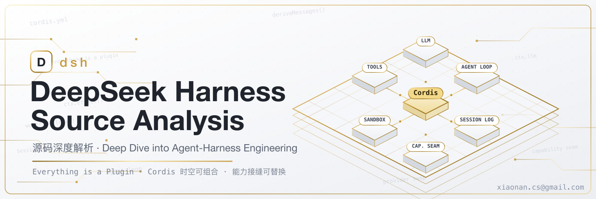

# DeepSeek Harness 源码深度解析

## 快速导航

- 📌 [总纲 · 技术主线分析](总纲-DeepSeek-Harness技术主线分析.md) —— 一句话主线、阅读路径、核心机制速览
- 🌐 [全网调研 · 社区认知地图](全网调研-社区认知地图.md) —— 外部基线、Cordis 血缘、公司理念、争议矩阵、盲区分析
- 📚 [Part I 理念与使用](#part-i-理念与使用)
- 🔧 [Part II 源码剖析](#part-ii-源码剖析)
- 🧭 [Part III 对比与元](#part-iii-对比与元)（含 Ch21 参考底座 Cordis 深度对比）
- 📕 [Part IV 论文研究](#part-iv-论文研究)（Spatiotemporal Composability 论文全解 + 论文↔dsh 映射）
- 🧬 [Part V Cordis 深度调研](#part-v-cordis-深度调研)（对 cordiverse/cordis 单独跑一遍深度解析 + 三者关系）
- 🛠️ [Part VI 开发规范与贡献工作流](#part-vi-开发规范与贡献工作流)（门禁 / 修改配方 / 代码评审 stacked-PR / 文档双语规范）
- 🗂️ [Part VII 设计决策志](#part-vii-设计决策志)（507 篇 ADR 决策地图 + 事故复盘与不变量）
- 📘 [官方文档对照](Appendix/官方文档对照.md) · 🗺️ [文档与技能全目录](Appendix/文档与技能全目录.md) · 🕵️ [生态反推与泄漏复盘](Appendix/生态反推与泄漏复盘.md)
- 📎 [Appendix 附录](Appendix/)

## 这份研究是什么

DeepSeek Harness 是 DeepSeek 开源的 agent 运行框架，核心理念是**一切皆插件**——连模型适配器、工具注册表、会话日志、agent loop 本身都是 [Cordis](https://github.com/cordiverse/cordis) 插件，全部可从配置替换。本研究以**一手源码为准**（结论尽量给 `文件:行号`），对"为什么这样设计"类动机保持证据边界（`[verified]`/`[inferred]`/`[claimed]` 三档标注）；承重的判断，连同它的取舍与根因，都直接写进正文分析。

## 基于的源码版本

本报告分析的对象与一手证据来自以下 git 仓库的具体快照：

- **仓库**：`https://github.com/deepseek-ai/deepseek-harness.git`
- **分支**：`master`
- **一手基线提交**：`47f943859bef60e4160492346772ded9b24f765a`（短 `47f943859b`；`Merge pull request #2519 …feat/npm-public`）
- **基线时间 / 规模**：2026-08-13，累计 **12,293** commits（版本 `0.1.0-rc.5`）

正文（第 01–35 章）一律以此 **rc.5 快照**为准。此后官方推进到 `0.1.0-rc.7`（`master` 提交 `99f6f02fec`、2026-08-17、12,404 commits），这段增量的逐条核实见附录《[版本更新追踪 · rc.5→rc.7](Appendix/更新追踪.md)》。参考底座 Cordis 另取自 `https://github.com/cordiverse/cordis.git`（见 Part V 与第 21 章）。本仓库为独立第三方分析，非 DeepSeek 官方产物。

## 阅读方式

- **想快速判断值不值得用**：总纲 → Ch01 → Ch19 → Ch20。
- **架构评审者**：Ch02 → Ch05 → Ch11 → Ch06/07 → Ch13 → 各能力域。
- **插件作者**：Ch04 → Ch08/09 → Ch11 → 对应能力域章。
- **AI 工程/研究者**：Ch03 → Ch20 → Ch19。

## 目录

### Part I 理念与使用

| 章 | 标题 | 提要 |
|---|---|---|
| 01 | [项目定位与开发者预览](Part%20I%20Principles%20and%20Usage/01-定位与预览.md) | dsh 是什么、为何以预览姿态开源、运行形态与分层 |
| 02 | [一切皆插件与 Cordis 底座](Part%20I%20Principles%20and%20Usage/02-一切皆插件与Cordis.md) | Context/Service/Plugin/effect 模型与 vendoring |
| 03 | [Spatiotemporal Composability 范式](Part%20I%20Principles%20and%20Usage/03-Spatiotemporal-Composability.md) | 可逆 effect / 响应式 coeffect、Koishi 血缘 |
| 04 | [Profile 与 Bundle 组装](Part%20I%20Principles%20and%20Usage/04-Profile与Bundle组装.md) | boot 时分层覆盖组装插件树 |

### Part II 源码剖析

| 章 | 标题 | 提要 |
|---|---|---|
| 05 | [微内核与事件分类法](Part%20II%20Source%20Analysis/05-微内核与事件分类法.md) | waterfall/serial/parallel/emit 四模式 |
| 06 | [Agent Loop 与回合流](Part%20II%20Source%20Analysis/06-AgentLoop与回合流.md) | turn/step 生命周期与容错 |
| 07 | [事件溯源会话日志](Part%20II%20Source%20Analysis/07-事件溯源会话日志.md) | model-visible⟺logged 不变量 |
| 08 | [系统提示词与工具 Schema 组装](Part%20II%20Source%20Analysis/08-系统提示词与Schema组装.md) | prompt-section / tool-schema 组装 |
| 09 | [工具注册表与执行管线](Part%20II%20Source%20Analysis/09-工具注册表与执行管线.md) | 三段 waterfall + guard 卫生 |
| 10 | [LLM 适配器与流式词汇](Part%20II%20Source%20Analysis/10-LLM适配器与流式词汇.md) | StreamChunk + 双适配器孪生 |
| 11 | [能力接缝架构](Part%20II%20Source%20Analysis/11-能力接缝架构.md) | Definition/Provider/Consumer 三角色 |
| 12 | [执行世界 Shell/Subprocess/Terminal](Part%20II%20Source%20Analysis/12-执行世界.md) | 三层执行 + request/spec 显式 resolve |
| 13 | [沙箱与进程约束](Part%20II%20Source%20Analysis/13-沙箱与进程约束.md) | bwrap/Landlock/Seatbelt、steering 立场 |
| 14 | [文件系统、LSP 与代码运行时](Part%20II%20Source%20Analysis/14-文件系统-LSP-代码运行时.md) | fs 策略 / LSP（Language Server Protocol，语言服务器协议）/ Code Mode |
| 15 | [编排与委派 Subagent/Workflow/Plan](Part%20II%20Source%20Analysis/15-编排与委派.md) | 委派 / worker 引擎 / plan 状态 |
| 16 | [上下文治理 压缩/注入/Skill](Part%20II%20Source%20Analysis/16-上下文治理.md) | compaction / context / skill / spill |
| 17 | [会话持久化、检索与远程接入](Part%20II%20Source%20Analysis/17-持久化检索与远程接入.md) | 持久化/检索/SDK（Software Development Kit，软件开发工具包）/ACP（Agent Client Protocol，agent 客户端协议）/API（Application Programming Interface，应用程序接口）/Web |
| 18 | [互操作与自我修改](Part%20II%20Source%20Analysis/18-互操作与自我修改.md) | MCP（Model Context Protocol，模型上下文协议）/ Hooks / extensions 自指运行时 |

### Part III 对比与元

| 章 | 标题 | 提要 |
|---|---|---|
| 19 | [竞品对比与生态定位](Part%20III%20Comparative%20Analysis/19-竞品对比与生态定位.md) | vs Claude Code / Codex / Pi + 生态理念 |
| 20 | [AI 自举开发与理念映射](Part%20III%20Comparative%20Analysis/20-AI自举开发与理念映射.md) | 12293 commits 轨迹 + 工程纪律 + 公司理念 |
| 21 | [参考底座 Cordis 深度对比](Part%20III%20Comparative%20Analysis/21-参考底座Cordis深度对比.md) | vendored Cordis 源码剖析 + dsh↔Cordis 对比 + 血缘 |

### Part IV 论文研究

支撑 dsh 的底座论文《A Programming Paradigm for Spatiotemporal Composability》（北大 × DeepSeek-AI，Tianyi Cui 为共同作者）的完整研究。

| 章 | 标题 | 提要 |
|---|---|---|
| 22 | [Spatiotemporal Composability 论文全解](Part%20IV%20Foundational%20Paper/22-A-Programming-Paradigm-for-Spatiotemporal-Composability.md) | 88 页正式版逐节精读：全章节覆盖 + 2 图 2 表 + 10 算法 + 18 定理 + 抽象总结（用 paper-research 工作流产出、`verify-report` 通过） |
| 23 | [论文与 dsh 映射](Part%20IV%20Foundational%20Paper/23-论文与dsh映射.md) | 论文范式 ↔ dsh 源码逐条映射（可逆 effect/reactive coeffect/生命周期/统一 context） |

### Part V Cordis 深度调研

对 dsh 的底座框架 [cordiverse/cordis](https://github.com/cordiverse/cordis) 单独跑一遍源码深度解析（Shigma 主导 537/550 commits，4 年演进）。

| 章 | 标题 | 提要 |
|---|---|---|
| 24 | [Cordis 总览与血缘](Part%20V%20Cordis%20Deep%20Dive/24-Cordis总览与血缘.md) | 元框架定位 + Koishi 血缘（git 实证同源）+ 9 包/9 模块 + dsh 关系锚点 |
| 25 | [Context 与 Service 模型](Part%20V%20Cordis%20Deep%20Dive/25-Context与Service模型.md) | ctx 容器 / Service / registry / reflect Proxy / inject |
| 26 | [Fiber 与可逆 effect](Part%20V%20Cordis%20Deep%20Dive/26-Fiber与可逆effect.md) | fiber 生命周期状态机 + epoch 驱动 + ctx.effect 反序回滚 |
| 27 | [事件系统](Part%20V%20Cordis%20Deep%20Dive/27-事件系统.md) | emit/waterfall/serial/parallel/bail；现役派发用 `Reflect.apply` |
| 28 | [Loader 与 HMR](Part%20V%20Cordis%20Deep%20Dive/28-Loader与HMR.md) | 声明式配置树装配 + 事务式热重载 + dsh profile/bundle 呼应 |
| 29 | [Cordis · Koishi · dsh 关系](Part%20V%20Cordis%20Deep%20Dive/29-Cordis-Koishi-dsh关系.md) | 血缘链 + 作者线 + 边界划分 + 论文—框架—产品三角 |

### Part VI 开发规范与贡献工作流

从 `docs/cookbook`、`development`/`testing`、`i18n/` 与 `.agents/skills` 提炼"怎么给 dsh 写代码、它的工程规矩"。

| 章 | 标题 | 提要 |
|---|---|---|
| 30 | [贡献流程与工程门禁](Part%20VI%20Dev%20Conventions/30-贡献流程与工程门禁.md) | 本地起步 / 源码平面 vs 产物平面 / 门禁清单（薄本地·厚 CI） |
| 31 | [修改配方](Part%20VI%20Dev%20Conventions/31-修改配方.md) | 加工具/包/vendored 包/LLM 适配器/会话节点/extension 的统一心智模型 |
| 32 | [代码评审与 stacked-PR 工作流](Part%20VI%20Dev%20Conventions/32-代码评审与StackedPR.md) | 评审纪律 + 原生 stacked-PR + 在栈上回应评审 + 配套 skill |
| 33 | [文档与双语规范](Part%20VI%20Dev%20Conventions/33-文档与双语规范.md) | JSDoc 契约 / prose 标准 / 双语配对门禁 / CoT 泄漏 / rescope |

### Part VII 设计决策志

把 `.agents/notes`（507 篇 ADR）与 `docs/postmortem` 提炼成决策与事故的主题地图。

| 章 | 标题 | 提要 |
|---|---|---|
| 34 | [设计决策地图](Part%20VII%20Design%20Decisions/34-设计决策地图.md) | ADR 格式与生命周期 + 六主题抽样 + 跨篇设计原则 |
| 35 | [事故复盘与不变量](Part%20VII%20Design%20Decisions/35-事故复盘与不变量.md) | 4 篇 postmortem 深读 + `ctx.invariants` + 防御性模式 |

### Appendix 附录

- 📘 [官方文档对照](Appendix/官方文档对照.md) —— 官方开发者文档站与本研究的印证/补充/修正
- 🗺️ [文档与技能全目录](Appendix/文档与技能全目录.md) —— 11 个 skill + 45 个子系统文档 + 每个 docs 子目录/顶层文档的完整测绘
- 📚 [官方文档地图](Appendix/官方文档地图.md) —— `docs/user`、cordis 教程/API 的分层导览
- ⚙️ [配置与工具参考（精编）](Appendix/配置与工具参考.md) —— `config-catalog`(132KB) 与 `tool-catalog` 的索引精编
- 🕵️ [生态反推与泄漏复盘](Appendix/生态反推与泄漏复盘.md) —— 社区第三方反推报告（泄漏/镜像证据）整理与源码交叉核实（`[claimed]` 为主）
- 🔄 [版本更新追踪 · rc.5→rc.7](Appendix/更新追踪.md) —— 基线之后（2026-08-17，12,404 commits）的增量逐条核实
- 📎 [Appendix/](Appendix/) —— 上游、证据等级约定、免责

## 免责

- 附录见 [Appendix/](Appendix/)。外部数据（star 数、HN（Hacker News，技术圈热门英文论坛）分数等）随时间变动，正文一律标 `[claimed]`；与源码冲突时以一手源码为准。
- 本研究为独立第三方技术分析，非 DeepSeek 官方文档。
