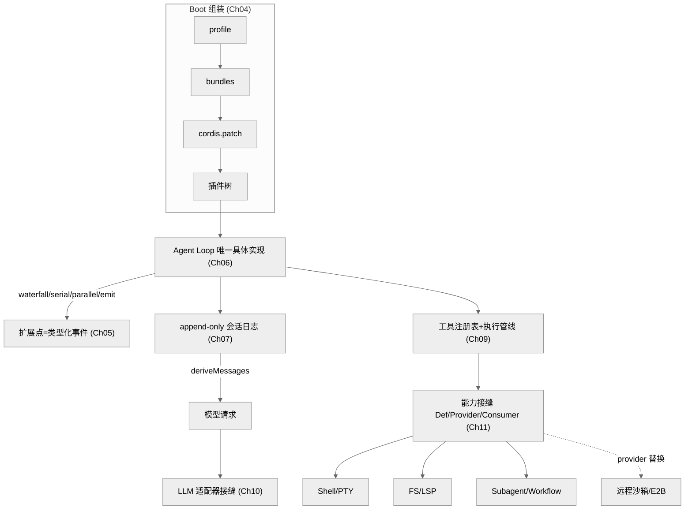

# 总纲 · DeepSeek Harness 技术主线分析

> 本文是整份深度解析的导论与主线索引。它先给出一条能贯穿全部章节的"主线论断"，再展开源码基线、阅读路径与证据纪律。各章在此主线上展开细节。
>
> 证据等级约定贯穿全文：`[verified]` 源码可证（文件:行号）· `[inferred]` 合理推断（有据但非直证）· `[claimed]` 仅社区/二手口径。对源码无法证明的动机，一律用「可能/或许/不排除」。

## 一句话主线

**DeepSeek Harness（`dsh`）把"模型是灵魂、一切皆可替换插件"这一信念，用一套"时空可组合"的微内核 + 制度化的 agent 工程纪律实现出来——它既是 DeepSeek 模型的官方 agent 运行框架，也是该公司"开源即贡献、护城河是团队与文化"理念在工具层的又一次落地。**

这条主线可拆成四个彼此支撑的命题：

1. **架构命题**：没有特权内核。连模型适配器、工具注册表、会话日志、agent loop 本身都是 Cordis 插件，全部可从配置替换（阶段2 源码可证）。
2. **范式命题**：其可替换性建立在 Cordis 的"时空可组合性"之上——组件卸载能完全回滚副作用（时间/可逆 effect），依赖以响应式方式声明（空间/响应式 coeffect）。这是有形式化论文支撑的范式，而非临时插件系统。
3. **过程命题**：这是一个**主要由 coding agent 编写**的代码库——不是推断，而是仓库自述（`quality-gates.md:11`："This codebase is developed primarily by coding agents"），2 个月 12,293 commits 佐证。它为此制度化了一整套面向 agent 的工程纪律：Agent Notes（505 篇已实现决策记录）、postmortem、100% 单文件覆盖、双语门禁、原生 stacked-PR。
4. **理念命题**：以上三者都能回溯到 DeepSeek 的公司理念——原创而非模仿、少即是多的工程审美、开源作为声誉/人才/标准战略、扁平且好奇心驱动。

## 源码基线（截至 2026-08-13，`0.1.0-rc.5`）

| 维度 | 数据 | 出处 |
|---|---|---|
| 原地址 | `github.com/deepseek-ai/deepseek-harness`，MIT，developer preview | README `[verified]` |
| 规模 | 7,412 版本内文件；2,319 `.ts`；2,355 `.md` | `git ls-files` `[verified]` |
| 包 | 219 个 `@deepseek-ai/dsh-*` workspace 包，按 49 个功能组组织 | `find packages -mindepth 3 -maxdepth 3 -name package.json` `[verified]` |
| 提交 | 2026-06-10 → 08-13，12,293 commits、5,610 merges，单日峰值 887 | `git log` `[verified]` |
| 底座 | vendored Cordis `4.0.0-rc.7`，rescope 为 `@deepseek-ai/cordis` | vendor/README.md `[verified]` |
| 运行 | `npx @deepseek-ai/dsh web` → `127.0.0.1:3080`；另有 headless/acp | README `[verified]` |

## 三个 Part 的组织逻辑

- **Part I 理念与使用**（Ch01–04）：先立"为什么这样"——项目定位、一切皆插件、时空可组合性范式、profile/bundle 组装。读完能回答"dsh 是什么、凭什么可替换"。
- **Part II 源码剖析**（Ch05–18）：主体。沿"回合流→会话→提示词→工具→模型→能力接缝→各能力域→远程/互操作/自我修改"逐层深入，每章七维分析 + 承重判断 ratify-note + ≥4 图。
- **Part III 对比与元**（Ch19–20）：跳出源码看生态定位（竞品对比）与元层面（AI 自举开发方法论 + 公司理念映射）。

## 推荐阅读路径

- **架构评审者**：Ch02 → Ch05 → Ch11 → Ch06/07 → Ch13 →（按兴趣）各能力域。
- **插件作者**：Ch04 → Ch08/09 → Ch11 →（对应能力域，如 Ch10 加模型、Ch14 加 fs/lsp）。
- **AI 工程/研究者**：Ch03（范式）→ Ch20（自举开发）→ Ch19（竞品）。
- **想快速判断"值不值得用"**：Ch01 → Ch19 → Ch20。

## 核心机制速览（供后续章节展开）

> 图注：一切经由 Cordis 插件树组装；扩展点是带明确 dispatch 模式的类型化事件；"模型可见 ⟺ 已记录"由会话日志保证；能力接缝让一次 provider 替换改变整个产品。此图的每个节点对应后续一到多章。

## 证据边界（本研究的自律）

- 架构与机制类结论尽量给 `文件:行号` 或对应 docs/ADR。
- "为什么这样设计""语言选型""团队动机"类判断：源码能证明**实现**，未必能证明**动机**。凡此类承重判断，正文以 **ratify-note** 呈现（候选解释 + 利弊 + 选定理由 + 证据等级 + 残余风险），并弱化措辞。
- 外部反响（HN、star 数、竞品对比）标 `[claimed]`，不当作源码可证事实。详见《全网调研-社区认知地图》。
