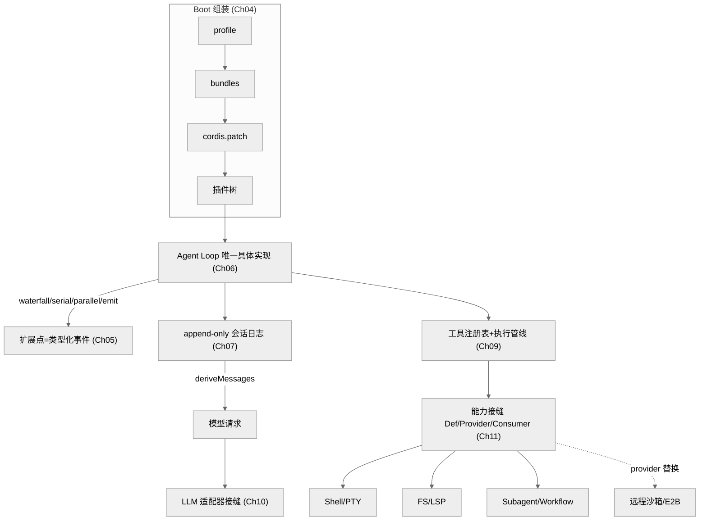

# 总纲 · DeepSeek Harness 技术主线分析

> 本文是整份深度解析的导论与主线索引。它先给出一条能贯穿全部章节的"主线论断"——也就是理解这套系统的那把总钥匙——再展开阅读路径与主线机制。各章在此主线上展开细节。
>
> 证据等级约定贯穿全文：`[verified]` 源码可证（文件:行号）· `[inferred]` 合理推断（有据但非直证）· `[claimed]` 仅社区/二手口径。对源码无法证明的动机，一律用「可能/或许/不排除」。

## 一句话主线

**DeepSeek Harness（`dsh`）把"模型是灵魂、一切皆可替换插件"这一信念，用一套"时空可组合"的微内核 + 制度化的 agent 工程纪律实现出来——它既是 DeepSeek 模型的官方 agent 运行框架，也是该公司"开源即贡献、护城河是团队与文化"理念在工具层的又一次落地。**

这句话里有两个可能陌生的词，先用大白话拆一下：

- **微内核**：借自操作系统的说法。传统内核什么功能都塞在核心里，微内核则只保留最小的"调度中枢"，其余功能都做成可插拔的模块。放到 `dsh` 这里，意思是——连"跑 agent 的主循环""接哪个大模型""怎么记会话"这些看似最核心的东西，都不是写死在中枢里的，而是一个个能换掉的插件。
- **时空可组合**：指这些插件不仅能在"空间上"自由拼装（谁依赖谁、装哪些不装哪些），还能在"时间上"干净地拆卸——卸载一个组件时，它之前做过的副作用（比如注册的事件、占用的资源）能被完整回滚，像没来过一样。

这条主线可拆成四个彼此支撑的命题：

1. **架构命题**：没有特权内核——也就是没有哪一块功能是"特殊的、不能碰的"。连模型适配器（对接大模型的那层）、工具注册表、会话日志、agent loop（agent 的主循环）本身，都是 Cordis 插件，全部可从配置替换。（Cordis 是这套系统底层用的插件框架，可以先理解为"专门负责让一切都变成可插拔模块的地基"；阶段2 源码可证。）
2. **范式命题**：其可替换性建立在 Cordis 的"Spatiotemporal Composability"之上——组件卸载能完全回滚副作用（时间/可逆 effect，即"做过的动作都能撤销"），依赖以响应式方式声明（空间/响应式 coeffect，即"我需要什么由我声明、框架自动喂给我，谁先谁后不用手工排"）。这是有形式化论文支撑的范式，而非临时拼凑的插件系统——支撑它的《A Programming Paradigm for Spatiotemporal Composability》是**北大 × DeepSeek-AI 的联合论文**，共同作者之一 Tianyi Cui 正是 dsh 的头号提交者（详见 [Part IV 论文研究](Part%20IV%20Foundational%20Paper/22-A-Programming-Paradigm-for-Spatiotemporal-Composability.md)）。这一点为什么重要：它意味着"可替换"不是靠约定或自觉维持，而是有底层机制兜底，插件装了又卸也不会留下脏东西。
3. **过程命题**：这是一个**主要由 coding agent（编程 AI 智能体，即能自己读写代码、跑命令的 AI 程序）编写**的代码库——不是推断，而是仓库自述（`quality-gates.md:11`："This codebase is developed primarily by coding agents"），2 个月 12,293 commits（commit 即一次代码提交）佐证。正因为主力"程序员"是 AI，它才格外需要一套能约束 AI、也能让 AI 之间协作的规矩，于是制度化了一整套面向 agent 的工程纪律：Agent Notes（约 505 篇已实现决策记录，相当于给后来者留的"当初为什么这么决定"的备忘）、postmortem（事故复盘）、100% 单文件覆盖、双语门禁、原生 stacked-PR（PR 即 Pull Request，拉取请求，一次待评审的代码合并提议；stacked-PR 就是把一串互相依赖的改动拆成层层叠放的小 PR 依次评审、合并）。
4. **理念命题**：以上三者都能回溯到 DeepSeek 的公司理念——原创而非模仿、少即是多的工程审美、开源作为声誉/人才/标准战略、扁平且好奇心驱动。也就是说，技术上的每一处取舍，背后都能找到一条更上层的价值观在支撑。

## 三个 Part 的组织逻辑

- **Part I 理念与使用**（Ch01–04）：先立"为什么这样"——项目定位、一切皆插件、Spatiotemporal Composability范式，以及 profile/bundle 组装（可以理解为"预设档 + 功能包"：profile 是一套面向某场景的默认配置，bundle 是一组打包在一起的插件，二者拼起来就搭出一个可用的 dsh）。读完能回答"dsh 是什么、凭什么可替换"。
- **Part II 源码剖析**（Ch05–18）：主体。沿"回合流→会话→提示词→工具→模型→能力接缝→各能力域→远程/互操作/自我修改"这条从里到外的线索逐层深入，每章七维分析 + 承重判断（取舍与根因直接写进正文）+ ≥4 图。
- **Part III 对比与元**（Ch19–20）：跳出源码，从更高处看它——生态里的位置（竞品对比）与元层面（AI 自举开发方法论 + 公司理念映射）。

## 推荐阅读路径

全书不必从头读到尾。按你的身份和目的，挑一条最短的线切进去即可：

- **架构评审者**：Ch02 → Ch05 → Ch11 → Ch06/07 → Ch13 →（按兴趣）各能力域。
- **插件作者**：Ch04 → Ch08/09 → Ch11 →（对应能力域，如 Ch10 加模型、Ch14 加 fs/lsp）。
- **AI 工程/研究者**：Ch03（范式）→ Ch20（自举开发）→ Ch19（竞品）。
- **想快速判断"值不值得用"**：Ch01 → Ch19 → Ch20。

## 核心机制速览（供后续章节展开）

下面这张图把整套系统的主干一次铺开：从最上面的"组装"开始，到 agent 主循环，再到它如何调工具、记日志、接大模型、伸出各种能力。你现在不必看懂每个节点，只需先记住这条水流的走向——后面每一章，都是在把图里的某个方块拆开细讲。

> 图注：一切经由 Cordis 插件树组装；扩展点是带明确 dispatch（分发，即事件按什么规则派给各个监听者）模式的类型化事件；"模型可见 ⟺ 已记录"由会话日志保证；能力接缝让一次 provider（能力的具体提供方，如某个 Shell 实现）替换改变整个产品。此图的每个节点对应后续一到多章。（图中 LLM = Large Language Model 大语言模型；PTY = pseudo-terminal 伪终端；FS = filesystem 文件系统；LSP = Language Server Protocol 语言服务器协议；E2B 是一个云端沙箱服务。）

## 证据等级约定

- 架构与机制类结论尽量给 `文件:行号` 或对应 docs/ADR（Architecture Decision Record，架构决策记录——把"某个设计为什么这么定"写下来存档的文档）。
- `[verified]` 源码可证 · `[inferred]` 合理推断 · `[claimed]` 仅社区/二手口径；对源码无法证明的动机（"为什么这样设计""语言选型""团队意图"）一律用「可能/或许/不排除」。外部反响（HN、star 数、竞品对比）标 `[claimed]`，详见《全网调研-社区认知地图》。
